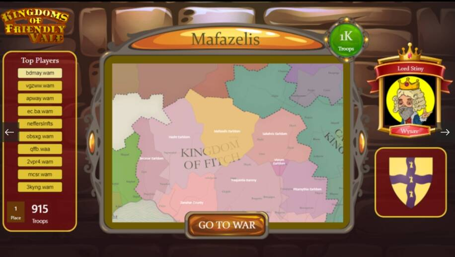

# Kingdoms of Friendly Vale

用你的机器人军队接管一个王国并建立它，直到你成为友好谷中最强大的统治者。Deck of Varmints 的存在是为了为他人提供积极的体验，而不是从他们身上榨取尽可能多的钱。 我们不炒作。如果你喜欢这个项目，一定要告诉你的朋友，草根营销很棒，但非常不鼓励人为地推销或过度推销该项目以从他人身上获利。任何被发现向陌生人发送垃圾邮件的人都将被禁止参与 DoV 不和谐。 友好谷王国首先是一款游戏，并非旨在成为有保障的收入来源。赚钱的潜力仍然存在，因为您可以获得可以转售的物品。然而，开发将专注于制作有趣的游戏，而不是最大化玩家的回报。 尽管短期利润不是重点，但我们确实相信通过有机的持续增长随着时间的推移为我们的产品创造价值。尽最大努力避免市场过度饱和是当务之急。欢迎所有人，我们不歧视noobiness、性别、种族、宗教、信仰、身份或取向。如果您以前从未玩过桌面游戏并想尝试一下，那么这是一个受欢迎的起点。

