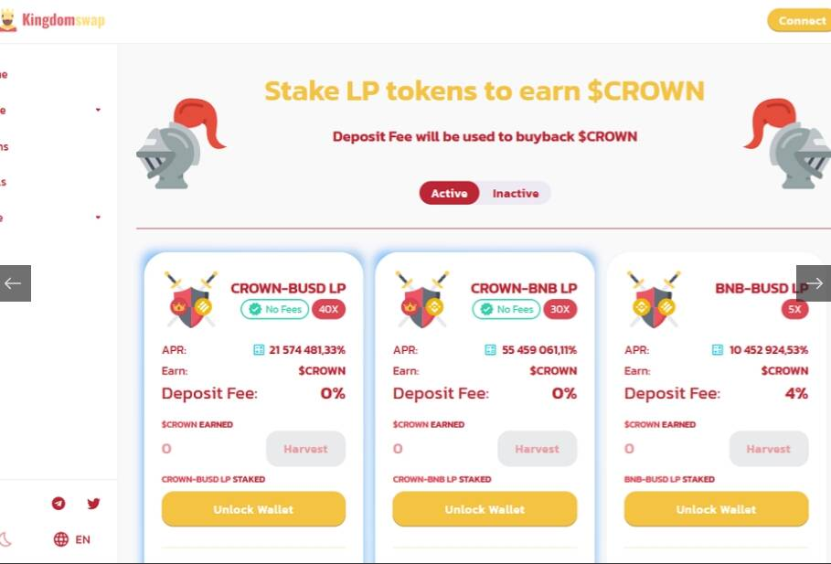

# KingdomSwap

首先，我们想告诉您两个要点：
✔️我们已删除迁移代码✔️已设置6小时时间锁定 公平发射相信公平和透明，因此我们为我们的项目选择公平的启动模式。只有 1000 个预先铸造的 $CROWN 代币将用于以下流动性池： · $CROWN/BNB 对 500 $CROWN · $CROWN/BUSD 对 500 $CROWN该交易所将于 2021 年 12 月 12 日星期五下午 1:00（UTC）开放。在第一个启动阶段，您将能够交换 $CROWN 和其他代币，以增加流动性并将代币和 LP 代币存入农场和矿池。此时不会激活任何奖励 第二启动阶段在此阶段，将为所有人激活耕作和质押奖励。代币经济学名称：$CROWN 合约地址：0x00eB4Df7cbeeD18De5AE416c432210D959c7F8bc 初始供应量：每块 1000 $CROWN

