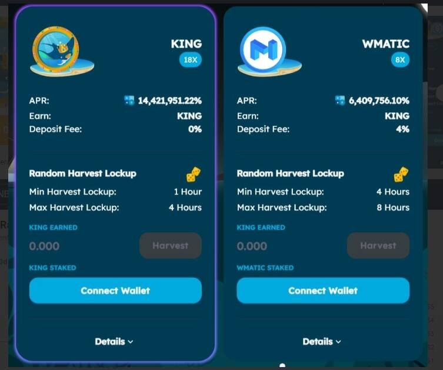

# KingMantaRaySwap

KingMantaRaySwap 由 PancakeSwap 和 Yield Farming 分叉，以及在 BSC POLYGON AVAX Fantom 上运行的 Staking 平台。KingMantaRaySwap 由 PancakeSwap 和 Yield Farming 分叉，以及在 BSC POLYGON AVAXFantom 上运行的 Staking 平台KingMantaRaySwap 借助 Yield Farming 的强大功能，在惊人的 APR 中充分发挥 DeFi 的优势。很快，Staking 将推出许多很酷的功能。这个池的流动性非常低，价格可能会有很大差异。什么是流动性？KingMantaraySwapToken (KING) 是一种加密货币

