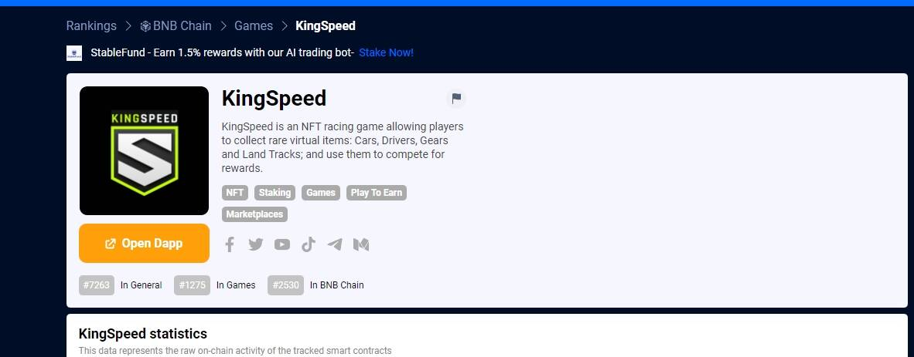

# KingSpeed

Kingspeed 是一款基于区块链的免费游戏和赚取收入的赛车游戏，玩家使用 NFT 赛车和设备在他们创造的巨大且不断扩大的赛车世界中挑战其他玩家。在 Kingspeed 中，用户可以收集稀有的虚拟物品，包括汽车、车手、齿轮和赛道。此外，他们可以使用他们的收藏品参加我们的赛车游戏。游戏的可收集组件的设计模拟了传统的基于稀缺性的收集游戏。我们的赛车游戏将包含多种游戏模式和活动，让用户在玩游戏的同时获得奖励。KingSpeed的灵感来自天启的想法，地震、海啸和火山爆发等极端现象频繁发生。 KingSpeed 的比赛旨在为不同的气候和地形寻找最好和最省油的汽车。 KingSpeed 是一款基于区块链的免费游戏和赚取收入的赛车游戏，玩家使用 NFT 赛车和设备在广阔且不断扩大的赛车世界中挑战其他玩家。在 KingSpeed 中，用户可以收集稀有的虚拟物品，包括汽车、角色、齿轮和赛道。玩家可以使用他们的收藏品参加比赛、竞争并获得奖励——并且可以领取一辆免费汽车来开始玩游戏。KingSpeed 的核心团队遍布游戏、区块链、艺术设计、加密和营销行业的面孔，他们共同拥有多年的经验，并共同愿景是将 KingSpeed 变成对区块链游戏和区块链游戏充满热情的人的生活方式。当然，赛车。

