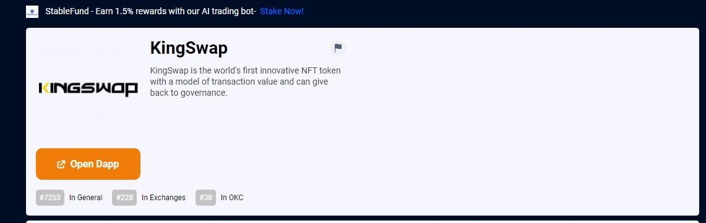

# KingSwap

KingSwap 是一种去中心化金融（DeFi）解决方案，用于链上资产的智能闪现。KingSwap 使用独特的技术允许个人和组织在 OKExchain 上轻松执行基于智能合约的协议。*KingSwap*是一个位于新加坡的 DeFi 项目，它引入了一个流动性池平台，可以进行法定出口匝道转换。定义 | 区块链 | 加密货币 | 去中心化金融*KingSwap*是最新的去中心化金融 (DeFi) 流动性池平台，它是一个更进一步且...*换金*。仪表板。一目了然地查看您的 King Tokens 余额。查看我们的横幅以获取独家优惠。转换老国王。NFT 转换/兑现将允许...

