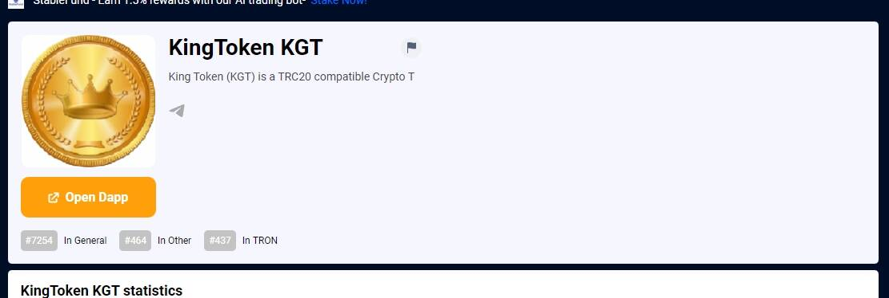

# KingToken KGT

King Token (KGT) 是托管在 Tron 区块链上的与 TRC20 兼容的加密代币。它是第一个通货紧缩和可开采的代币，通过股权证明 (POS) 采矿，您可以简单地抵押您的 KGT 并让它们自动增长。现场 DEX 和许多其他 dapp！King Token (KGT) 是一种兼容 TRC20 的 Crypto TKing Token (KGT) 是托管在 Tron 区块链上的与 TRC20 兼容的加密代币。它是第一个通货紧缩和可开采的代币，通过股权证明 (POS) 采矿，您可以简单地抵押您的 KGT 并让它们自动增长。现场 DEX 和许多其他 dapp！

