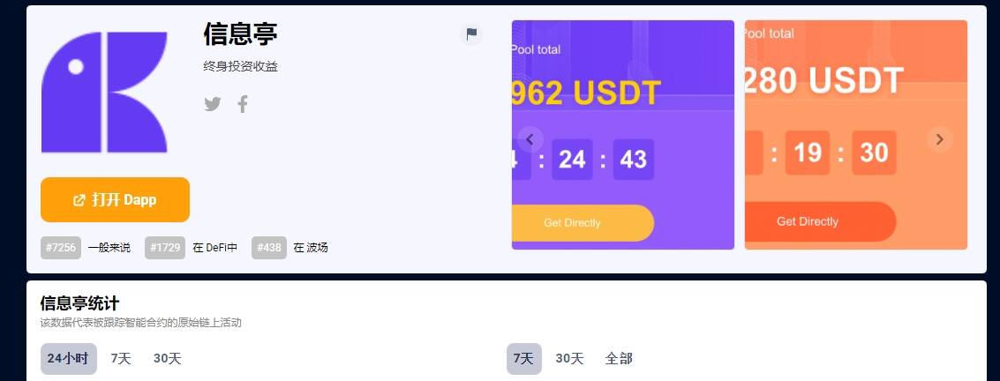

# Kios

KIOS 是一种基于 USDTTRC 代币的奖励模型。用户可以登录KIOS网站，连接TRC钱包并参与活动，通过挖矿和推荐活动获得额外奖励。终身投资收益大家好，我们是KIOS项目组。KIOS 将于 2021 年 1 月 18 日晚（美国东部时间上午 9:00）正式启动合约。谢谢您的支持！Kios 将准时启动现在，KIO的年化收益在1200%左右，KIS的年化收益在75%左右。91.5 奥马哈公共广播电台*KIOS* -FM，NPR 新闻、爵士乐等的发源地。来自 NPR、APM、PRI、BBC 以及当地新闻、爵士乐和蓝调的节目在线收听*KIOS* -FM - Omahas Public Station 91.5 FM 互联网广播。访问免费的广播直播，一目了然地发现更多广播电台。

