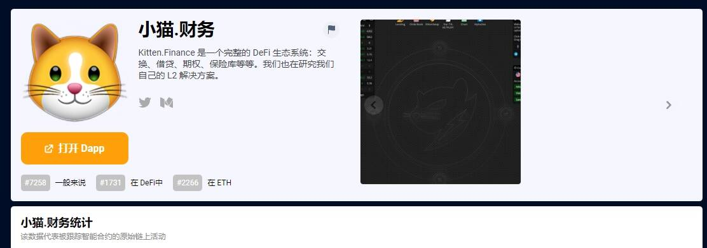

# Kitten.Finance

Kitten.Finance 是一个完整的 DeFi 生态系统：交换、借贷、期权、保险库等等。我们也在研究我们自己的 L2 解决方案。Kitten.finance 是一个 DeFi 生态系统，拥有我们自己的借贷、掉期、期权等设计。阅读我们的[媒体](https://kitten-finance.medium.com/)以获取信息。Kitten.finance 旨在为所有智能合约和 DApp 提供波动率表面和收益率曲线。当您将 kBASEv0 放入池 203 时，它将自动转换为 nkB（norm-kBASEv0），即“如果 kBASEv0 的总供应量为 1M，您将拥有的 kBASEv0 数量”，因此不受 rebases 的影响。并且 nkB 的数量与 kBASEv0 的数量不同，因为 kBASEv0 的总供应量与 1M 不同。当您取消质押 nkB 时，它将自动转换回 kBASEv0。一个例子：[假设 kB 总供应量 = 3M] => [您存入 3000 kB，变成 1000 nkB] => [kB 重新调整为 4M 总供应量，并且 nkB 不受影响] => [但是如果你现在取消 1000 nkB，它变成 4000 kB]。因此，您的 kB 已正确重新设置基础。

