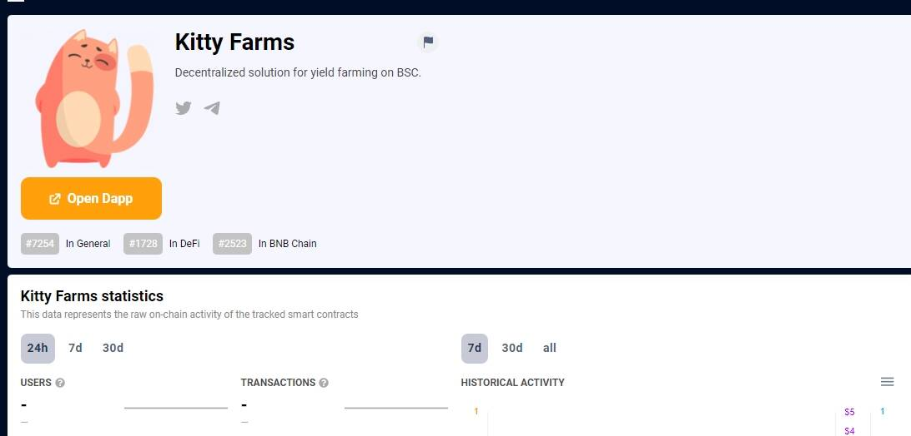

# Kitty Farms

Kitty Farms 是 BSC 上用于单产农业的去中心化解决方案，具有额外的机制来保护用户免受风险，因此您不必为高盈利能力而付出高昂的风险。用户将通过参与 KittySwap 上的流动性池来赚取本地货币 $Kitty，此外，猫爱好者可以使用他们赚取的 $Kitty 来质押和赚取其他代币并解锁独家功能。起初，我们的平台只会提供赚取 Kitties 的机会，但后来我们计划与更大的项目合作并添加其他代币，这些代币将通过质押 Kitties 来赚取。BSC 上用于单产农业的去中心化解决方案。

