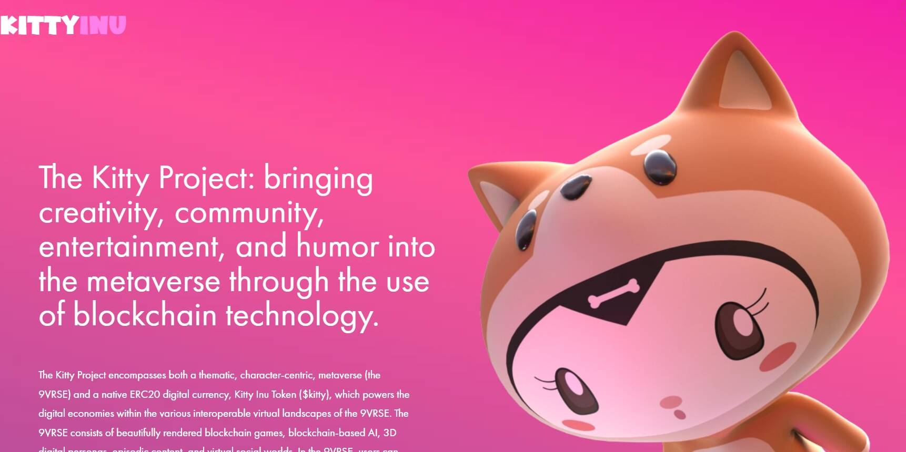

# Kitty Inu

镇上有一只新的狗狗。 Kitty 是一种游戏和 NFT DeFi 协议，为 Play-to-Earn 和 Metaverse 生态系统提供动力。Kitty 的使命是建立最好的社区驱动的游戏和 NFT&nbsp;Defi 协议，并由 Defi 中最好的团队之一提供支持。部分 Kitty，部分 Inu，Kitty Inu 将向月球发出呜呜声和喵叫声。Kitty 项目包括主题、以角色为中心的元宇宙（9VRSE）和原生 ERC20 数字货币 Kitty Inu 代币（$kitty），它为 9VRSE 的各种可互操作虚拟环境中的数字经济提供动力。9VRSE 由精美渲染的区块链游戏、基于区块链的人工智能、3D 数字角色、情节内容和虚拟社交世界组成。在 9VRSE 中，用户可以通过使用 Kitty Inu 代币来播放、体验、探索和货币化他们的内容

