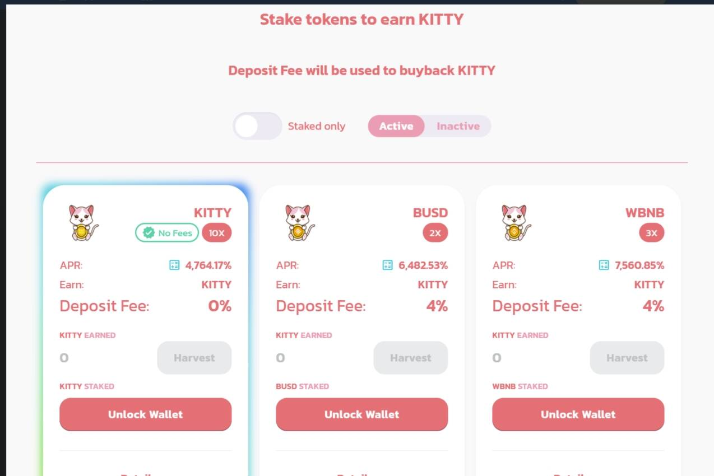

# KittySwap

介绍KittySwapi 是币安智能链上一个新的去中心化 AMM 交易所和收益农场，具有许多新功能。我们的主要目标是提供一个具有良好 APR 的 AMM 交易所，具有强大的燃烧机制，让代币升值，并通过我们的多重新功能激励用户使用我们的代币。‌我们相信我们的代币应该具有价值，并激励我们的用户购买和使用它们。因此，我们也将很快添加彩票，将使用 BNB &amp; 的赌场游戏。我们的 $KITTY 代币，以及很快我们将在 BSC 上推出我们的 CryptoKitties 版本的 NFT 市场。‌核心功能独特的燃烧机制
为了解决大多数 DeFi 项目面临的通货膨胀问题，我们将代币销毁机制引入我们的项目，提高 KITTY 代币的价格和价值。 仅在质押时将收取 4% 的销毁费，在提款时收取 0%。‌ 销毁交易费（4% 的 75%）将用于回购 $KITTY 并销毁‌‌MEGACAT 彩票——使用 $Kitty 代币参与，我们还将烧掉 20% 的底池‌‌
赌场游戏 — 使用 $Kitty 代币和 $BNB 在我们的赌场游戏中试试运气。更多游戏将在不久的将来添加。参与我们游戏的 1% 费用，其中 75% 将用于回购和销毁。‌农场&amp;赌注 您可以在我们不同的农场中种植我们的 $KITTY 代币和以良好且可持续的 APR 参与我们的资金池安全 Timelock 24h 在启动时添加到合约中删除了 Rugpull 迁移器代码 PancakeSwap 中最初的 rug pull 迁移器代码已被删除。请放心，我们不能也不会地毯拉你。我们在这里开发最好的 AMM 交易所之一。

