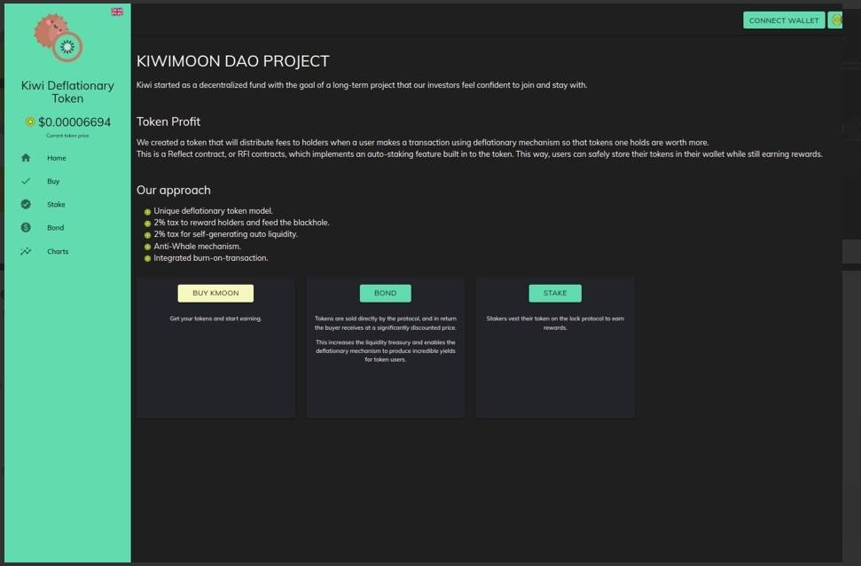

# Kiwi Deflationary Token

Kiwi 通缩代币Kiwi 最初是一个去中心化基金，目标是一个让我们的投资者有信心加入并坚持下去的长期项目。代币利润我们创建了一个代币，当用户使用通缩机制进行交易时，它将向持有者分配费用，从而使持有的代币价值更高。这是一个 Reflect 合约或 RFI 合约，它实现了代币中内置的自动质押功能。这样，用户可以安全地将他们的代币存储在他们的钱包中，同时仍然可以获得奖励。
我们的方法独特的通缩代币模型。2% 的税收奖励持有者并养活黑洞。 自行产生的汽车流动性征收 2% 的税。反鲸机制。集成的交易燃烧。

