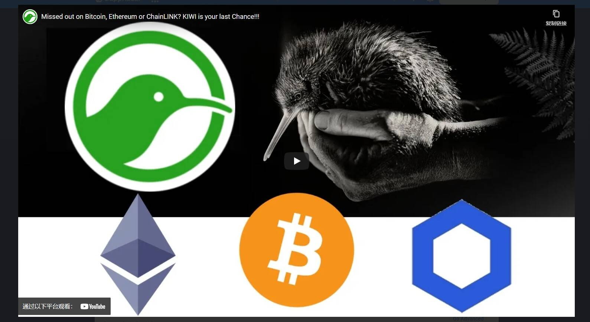

# KIWI Wallet

KIWI 钱包使用户能够在链下和链上进行快速、免费和私密的小额支付。 KIWI PoW 代币是一个社区项目，也是首批可开采的 ERC20/918 代币之一。没有预挖或 ICO。因此，它具有内在价值、公平分配和没有公司议程。 KIWI 用于加密货币支付、NFT 交易、参与奖励和社区发展。这是社区驱动的创意工作的自然选择。作为标准的以太坊 ERC 代币，KIWI 100% 兼容所有基于以太坊的服务和 dApp。 KIWI 可以使用 CPU 或 GPU 使用剩余容量和其他方式浪费能源单独开采 - 对于潜在的加密货币矿工来说，这是一个完美的入门项目。

