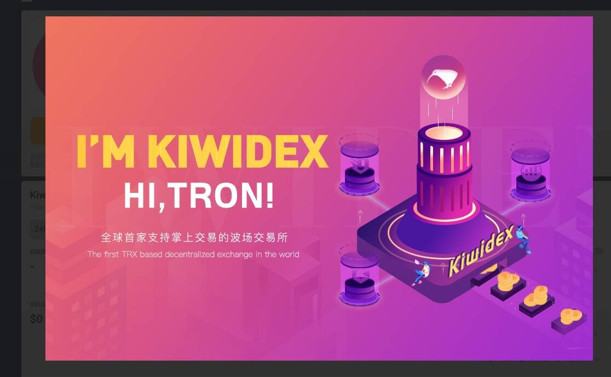

# Kiwidex

Kiwidex 是世界上第一个基于 TRON 的去中心化交易所，还支持在移动设备上处理交易。它是一个拥有完整安全的移动操作系统和广泛网络的平台，可以匹配买卖双方完成交易。波场生态中的各类代币都可以在这里自由交易，交易日期开放，可实时查询。它专注于为用户提供可以与中心化交易所相媲美的安全且易于使用的用户体验。Kiwidex 是世界上第一个去中心化交易所2022 年 2 月 12 日— *WikiDex*是由神奇宝贝粉丝创建的最大的西班牙语百科全书。*wikidex* .net 前 10 名竞争对手和替代品。一键免费分析*wikidex* .net 等按关键字和受众相似度排名的网站。

