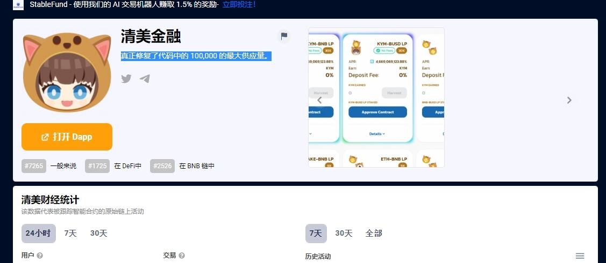

# Kiyomi Finance

POKI 最大供应量 80,00010% 转让税：1% 燃烧4% 用于农业POKICR 质押 5%
通货紧缩农业循环：耕种、转移、烧毁、再分配可变排放：农场收到的 POKI 总数除以 360000 块
基桥：迁移：POKI 从 BSC 到 PolygonPOKICR 从 BSC 到 Polygon挂钩：将 WBNB 与 kibWBNB Peg Liquidty(BSC) 到 Polygon桥接：USDC、USDT、DAI转账真正修复了代码中的 100,000 的最大供应量。一种分发令牌的新方法。KiCredit 系统正在进行中。 通货紧缩的农业永远。一种分配代币的新方法

