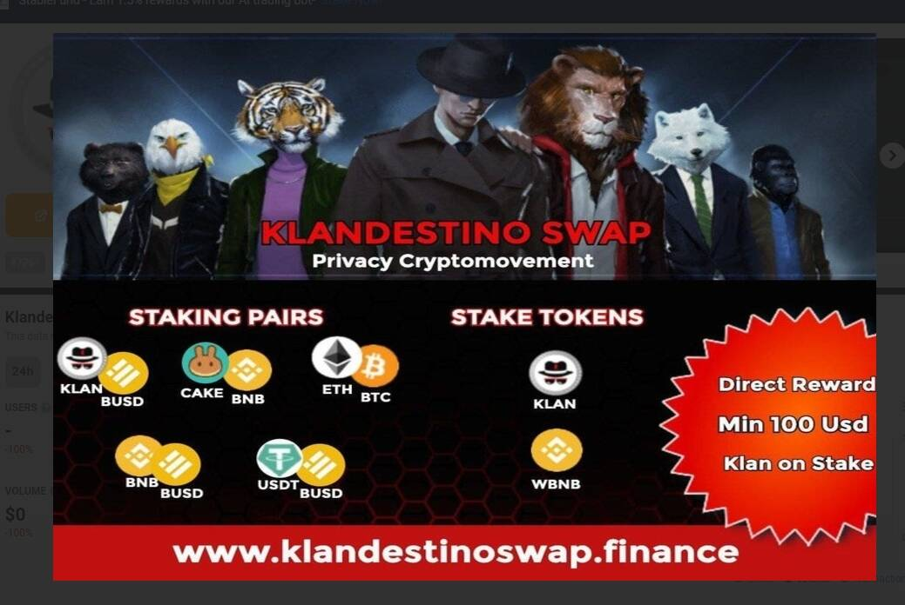

# Klandestino Swap

什么是 Klandestino Protocole？ (KlandestinoSwap)
Klandestino Swap 是一个去中心化的“DEX”交易所，用于交换币安链网络上推出的 BEP-20 代币。这是一个允许交易者、开发商和流动性提供者在全球范围内以完全访问权限访问平台的市场。 Klan 代币和 Klandestino 交易所没有订单簿，但它们与流动性基金 (LP) 中的自动做市商 (AMM) 合作，您可以在其中下注并获得 Klan“POA”奖励。在 Klandestino 贷款工具中，用户必须将所需的加密资产存入协议中才能获得退款。该加密资产以等量的 Ktoken 提供给用户使用，或者存款可用于以固定或可变的自动百分比借贷KLAN 是本机实用程序令牌，用于： 农业方面的额外奖金。&nbsp;
 Holder Klan 将迁移到更安全的 Block 并保护隐私和匿名性。通过 Staking KLAN 代币在网络上运行验证节点。用于治理投票，以确定如何分配网络资源。有多少 Klan 代币在流通？Klandestino Protocol 于 2021 年 6 月 1 日启动了其主网，在创世时创建了 3000 万个 KLAN 代币。 150 万用于奖励错误，另外 150 万用于额外奖金。 27 磨机在流通。在初始 LP 的预售中增加。团队不保留任何东西，必须像任何创始人或用户一样参与。除了 Klan 燃烧之外，其余的都在 Farming 中添加&nbsp;
我在哪里可以买到 KLAN？KLAN 可在越来越多的交易所使用加密货币和 [stablecoin BUSD] 进行交易

