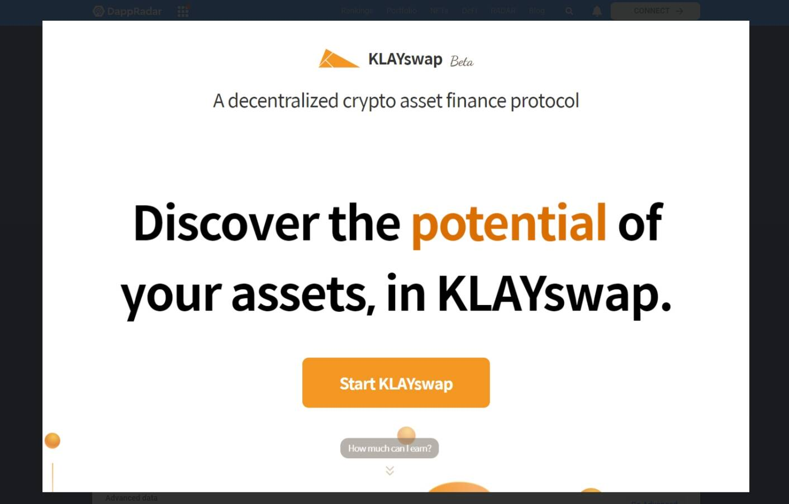

# KLAYswap

KLAYswap 是一个完整的链上即时交换协议，与链上流动性池一起运行，流动性由自动做市 (AMM) 机制保证。它是一种链上交换服务，允许任何拥有任何 KLAY 或 KCT 类型的代币加密货币的人成为流动性提供者，并从交易费佣金中获得收入。在 KLAYswap 中，基于以太坊的代币（ETH、ORC、DAI、WBTC）可以通过 Orbit Bridge 转移到 Klaytn 生态系统，Orbit Bridge 是一个透明的 IBC 桥，建立在 Orbit Chain 上，提供收益农业和以前在去中心化世界中未连接的资产配对

