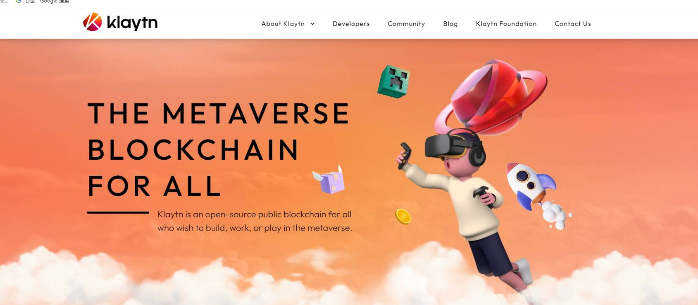

# Klaytn Horizon

从未想象过的区块链应用新体验。加入克莱顿地平线，我们的第一场 BAPP 比赛奖池 $1,000,000韩国首尔， 2019年12 月 12 日/美通社/ -- 由韩国互联网巨头 Kakao 领导的领先区块链项目 Klaytn 宣布了其 BApp（区块链应用）竞赛“Klaytn Horizon”的获胜者。Klaytn Horizon 邀请全球所有开发人员在 Klaytn 平台上构建区块链应用程序，该平台的主网于今年 6 月推出。Klaytn 优先考虑大规模采用区块链和建立生态系统，并期待能够促进区块链体验的有能力的区块链项目。

