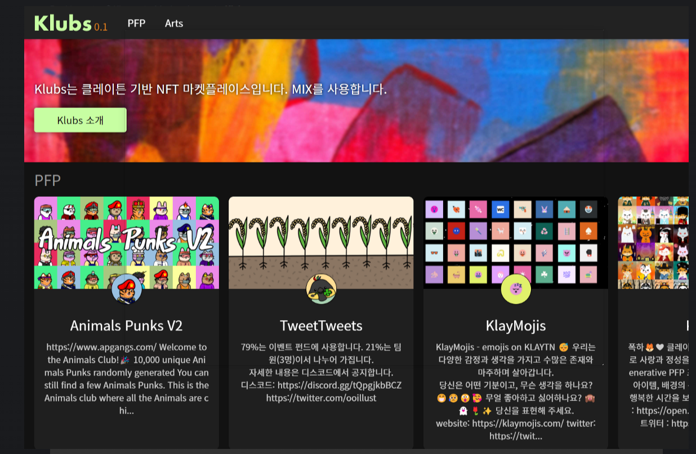

# Klubs

Klubs 是基于 Klaytn 的具有 MIX 的 NFT 市场。Web+1韩国频道新设。无论我们如何努力开拓海外市场，我们的团队成员都是来自韩国，用韩语与韩国人交流非常重要。Web+1 将继续努力，支持“大家一起”在 Web3 的精彩世界中航行。谢谢你绍负责运营 KLUBS 的链上组织 Web+1 的中长期业务的 CAP。所有在 KLUBS 注册的项目在申请 CAP 时均享有折扣等优惠。如果您对项目运营商感兴趣，请联系 KLUBS Discord #╰1vs1-ticket 频道。

