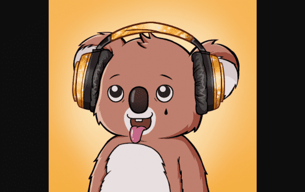

# Koala Intelligence Agency

总共有 10,000 只独特的考拉经过全面培训并准备部署。他们是伪装大师，在没有留下一丝证据的情况下从公众中筛选。

Koala Intelligence Agency NFT（简称 KIA）是 10000 个拥有个人技能集的 Koala Agent NFT 的集合。每个考拉代理 NFT 的使命是...

围绕该机构的工作从未停止。因此，考拉总部已授权为每个考拉代理分配一名新兵，以帮助完成工作量。

新兵是训练中的小考拉。他们做特工的所有无聊和肮脏的工作。

他们在下一个任务中收集宝贵的情报。他们做需要做的事情。

