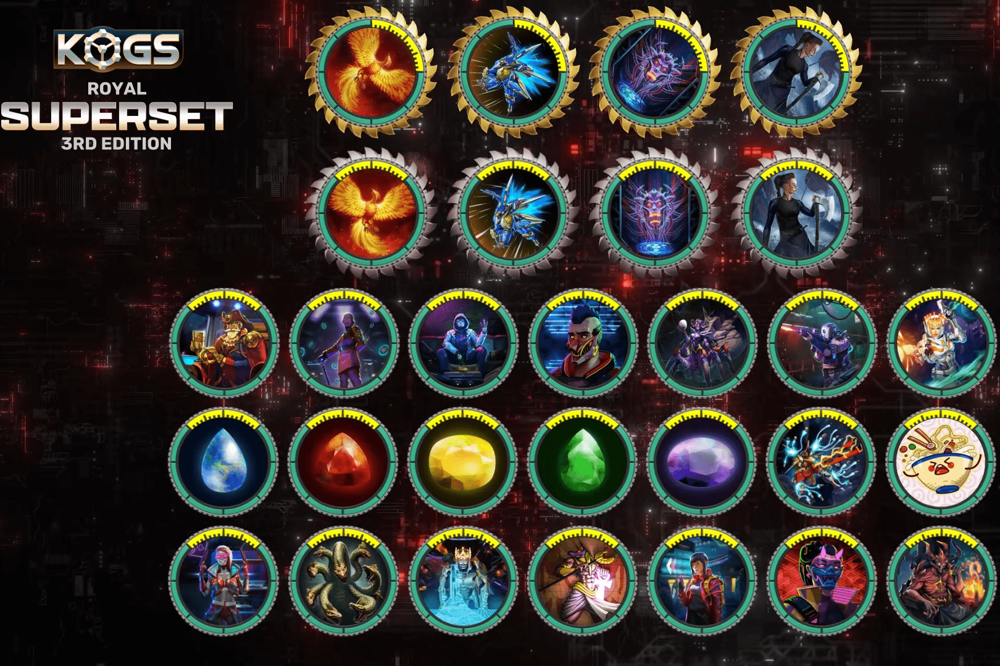

# KOGs

KOG 具有独特的设计和边框组合，使它们在外观和功能上有所不同。 KOG 越稀有，它将在生态系统中解锁的功能就越多。 KOG 共有 10 个主题集，捕捉了让您想要将它们全部聚集起来的时间段、风格和动作。如果没有 Slammer 和超稀有，任何收藏都不会完整，但最终收藏家的目标是完成整套。
KOG 或其他游戏的钥匙将为您提供一系列不同游戏中的锦标赛、游戏、独家关卡、稀有皮肤、难以捉摸的武器等等。

