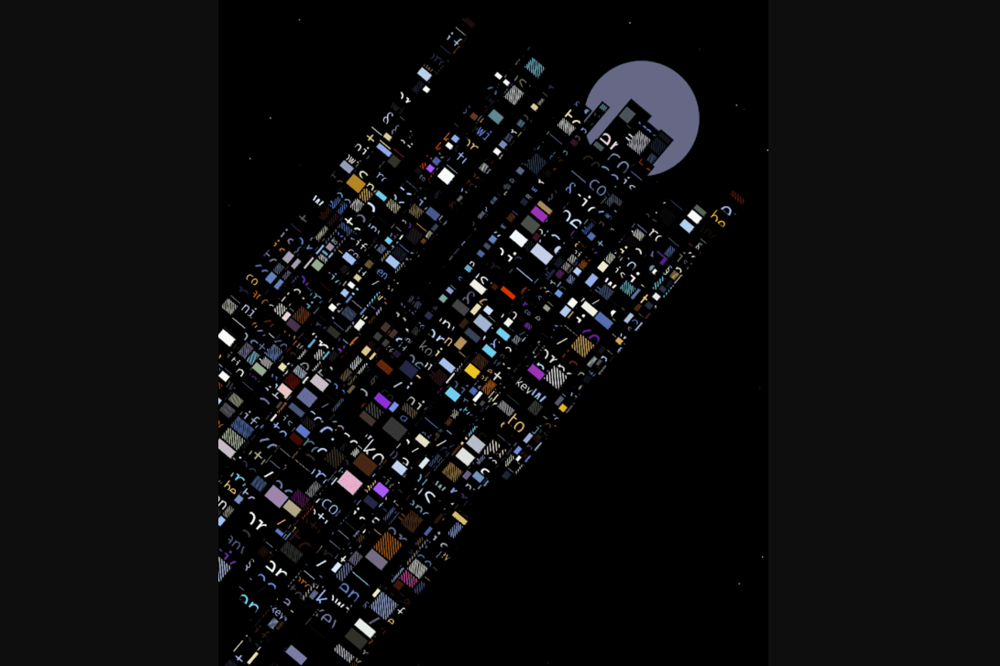

# Kohi x eepmon CityLights

Kōhī CityLights 是由数字艺术家 eepmon 创作的一个系列。受到东京充满活力的城市景观的启发，eepmon 经常前往大都市寻找他的创意灵感来源。 Kōhī CityLights 限量发行 1,024 枚，完全在 Solidity 链上构建。

Kohi x eepmon CityLights——精心策划的数字艺术品收藏，存储在以太坊区块链上。集合是使用 Kohi Composer 和 Kohi Compiler 构建的。

Kohi x eepmon CityLights

艺术家的选择是基于他们的创作艺术经验、知识和整个作品集。该团队与社区密切合作，审查艺术家的申请并决定代表谁。 CityLights - 一个系列，由 eepmon 创作，灵感来自日本充满活力的城市景观。

该平台将一个低级的处理式 API 直接嵌入到 NFT 合约中，为任何艺术项目提供链上图形光栅化。
Kohi x eepmon CityLights
Kohi 编译器将创建可靠的指南来重新创建艺术家的预期作品。最终结果是全分辨率合成，无需额外步骤即可完整再现作品。

要参与 Kohi x eepmon CityLights，您需要安装一个 dApp 钱包（目前由 Metamask 支持）并在您的钱包中有一些 ETH 来购买（铸造）Kohi 上的收藏。

目前，网站上没有白皮书和路线图。相反，开发人员提供了其他介绍性文档：博客、常见问题解答部分和网站的简要说明。

如果您想及时了解所有创新，请订阅以下社交网络上的社区：

推特
;
不和谐。
您还可以在网站上留下您的电子邮件地址，以接收包含项目新闻的时事通讯。智能合约没有审计。

