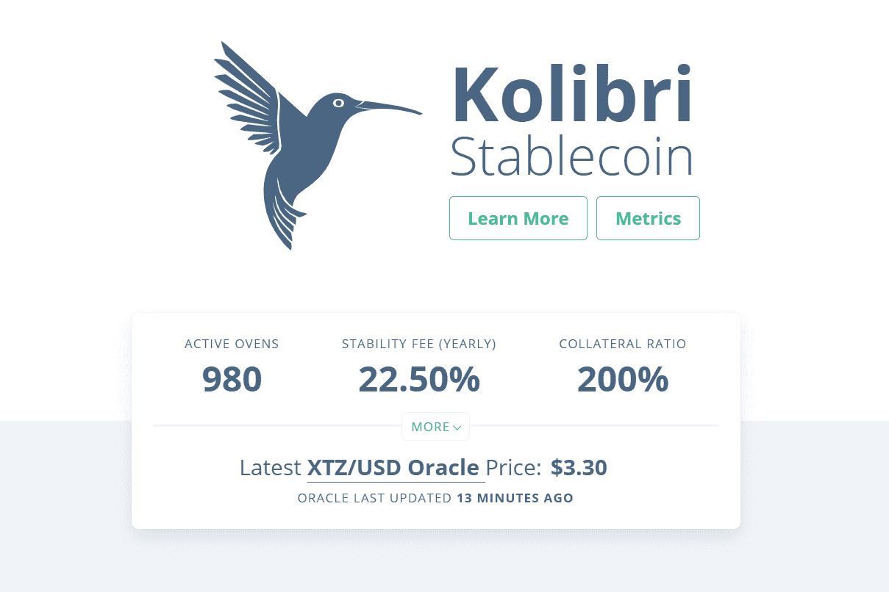

# Kolibri

Kolibri 是一种基于 Tezos 的稳定币，建立在称为 Ovens 的抵押债务头寸 (CDP) 之上。 Kolibri 使用 CDP 来抵押软锚定美元稳定价值资产 kUSD。数据是通过 Oracle 合约通过 Harbinger Price Feed 提供的。

Kolibri 学习平台附带教练仪表板、考试创建、练习、差异化教学内容分配和...

Kolibri 是一个开源教育平台，可以离线访问开放许可的内容库，以便在资源匮乏的环境中使用。

