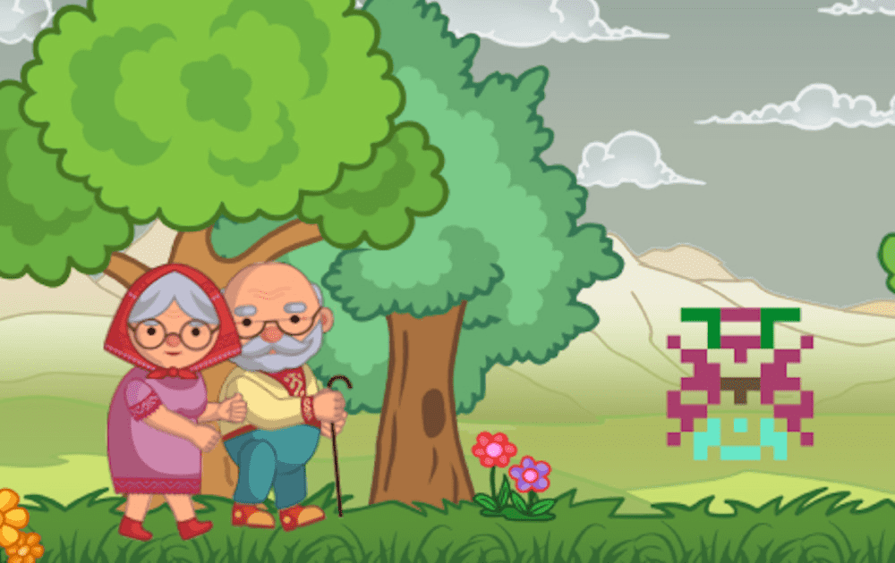

# Kolobok Adventures

Kolobok.io — 培育独特的 Kolobok 并进行冒险以获得 NFT 奖品！
收集、交易、培育 Koloboks，然后将它们送去冒险以赢取奖品！
由 CryptoLions 团队创建并由 SimpleAssets Standard 提供支持的游戏

K2 是一款创新的区块链 NFT GameFi，主线剧情基于东欧童话《Kolobok》。每个 Kolobok 都是独特的 NFT 生物，在 WAX 区块链上生成并归玩家所有。培育独特的 Koloboks、进行冒险、赢取、交易、收集 NFT 并与社区互动。 K2 版本仅在 WAX 上提供。玩赚取 KBUCKS 并赢取 NFT 奖品！

