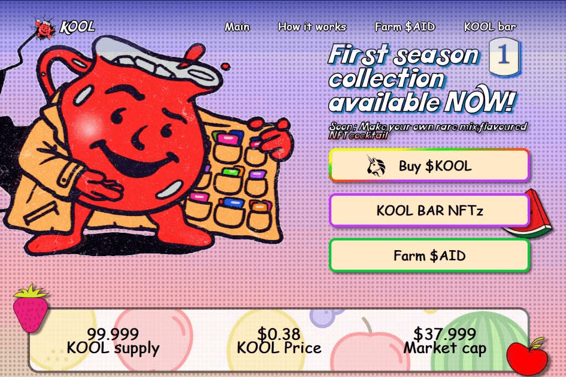

# Kool Bar

Kool Bar 由 2 个代币提供支持：KOOL 和 AID。 KOOL 是 Uniswap 上可交易的固定供应量的主要代币。 AID 是一种补充通胀代币，可以通过质押 KOOL 和 KOOL/ETH LP 代币来进行养殖。
Kool Bar 包括不同稀有度的 NFT 风味：普通、罕见、稀有和超级稀有。
口味是季节性的，但有些可能会在未来的季节中作为混合成分重新出现。
普通口味正在出售用于援助。 Uncommon、Rare 和 Super Rare 只能通过混合获得。常见的口味是 Kool Bar 的基础，因为没有它们就无法混合鸡尾酒。如果你想完成整个季节的收藏，你最好拥有几个每种常见风格的 NFT。每次混合新鸡尾酒时，其成分的 NFTz 都会燃烧，因此变得越来越稀缺。在某些情况下，某些常见口味可能会比稀有口味更稀缺！

