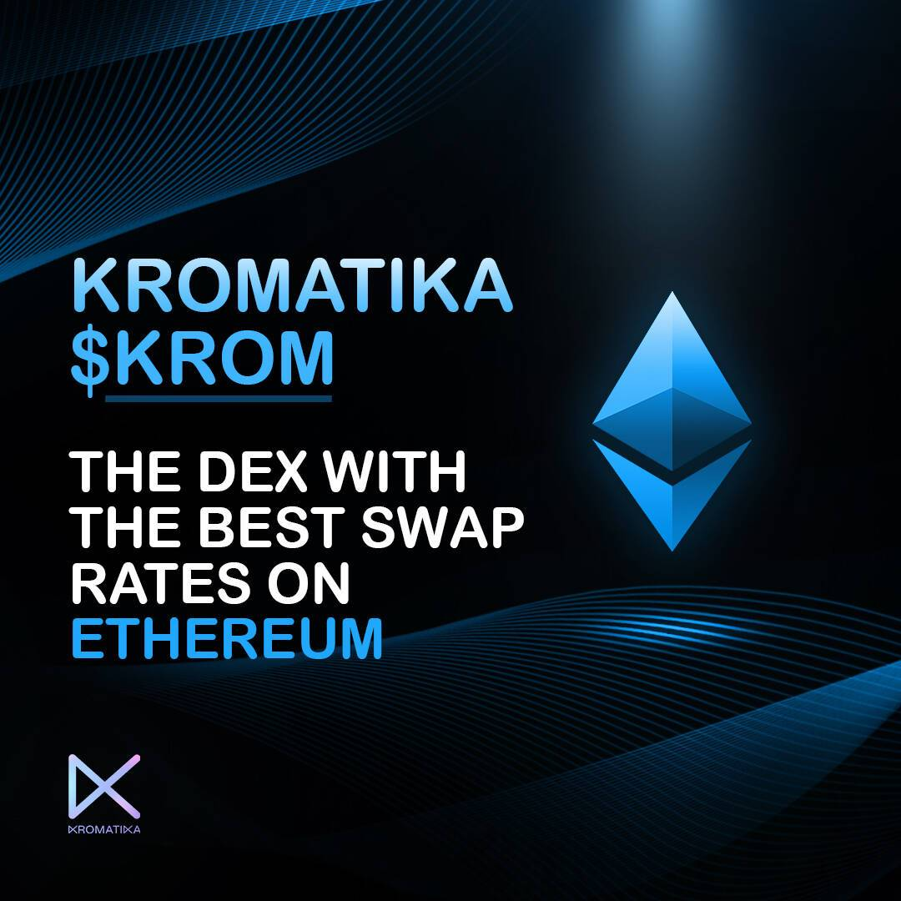

# Kromatika Finance

它是如何工作的 为什么 KROMatika 隐藏的宝石：在 DAPP 中，用户可以为他们的交易自动处理选择较低的目标 gas 价格，甚至进一步降低服务费，牺牲一些处理速度来降低服务费。
KROMATIKA — 由 Uniswap 和 Chainlink 提供支持的下一代 DEX 交易
KROMatika 包括：

  用于创建交易和处理交易的经过审计的智能合约，均由 Uniswap 提供支持。
  用于与 KROMatika 智能合约交互的 UI。
  链下去中心化处理服务，负责主动处理交易，由 Chainlink Keepers 提供支持。
  KROM 代币 — 用于支付服务费的实用 ERC20 代币。该费用由用户支付，用于支付处理服务（Chainlink Keepers）的费用。
  在 Uniswap V3 上进行交换时，用户支付所谓的交换费，即：0.05%、0.3% 或 1%。在 KROMatika 上进行交易时，用户无需支付掉期费，而是支付服务费。
  交换费取决于交换的金额，而服务费是固定的。
  实际服务费以 ETH 支付，因为这是处理服务的实际成本（gas 费），但用户始终使用 KROM 代币支付。
  KROM 代币可以节省大量的服务费，接近于零服务费。
  早期的 KROM 代币持有者可以节省大量的服务费，因为他们会以便宜的价格购买代币，并在其代币价格上涨时支付服务费（固定 ETH）。

