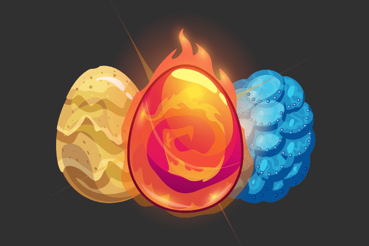

# Kryptomon

Kryptomons 是建立在 BSC 区块链上的数字收藏怪物。可以使用我们专用的 BEP20 代币 (KMON) 购买它们。与其他玩家繁殖，创造出具有令人兴奋的特性和新的力量水平的新蛋。
在发布时，10,000 个独特的鸡蛋将存储在 BSC 区块链上的智能合约中。
每个鸡蛋都有一个独特但可变的遗传密码（基因型）和存储在智能合约中的独特视觉外观。遗传密码由 38 种不同的基因型组成，它们将决定你的生物的所有方面——包括身体和行为方面。你的氪星需要注意，如果你不定期照顾它，它可能会死去，就像在现实生活中一样，死亡将是不可逆转的，你的蛋永远丢失，NFT 代币被烧毁。
Kryptomon 是 NFT 领域的一个独特概

念，一种真正的生物体验。
