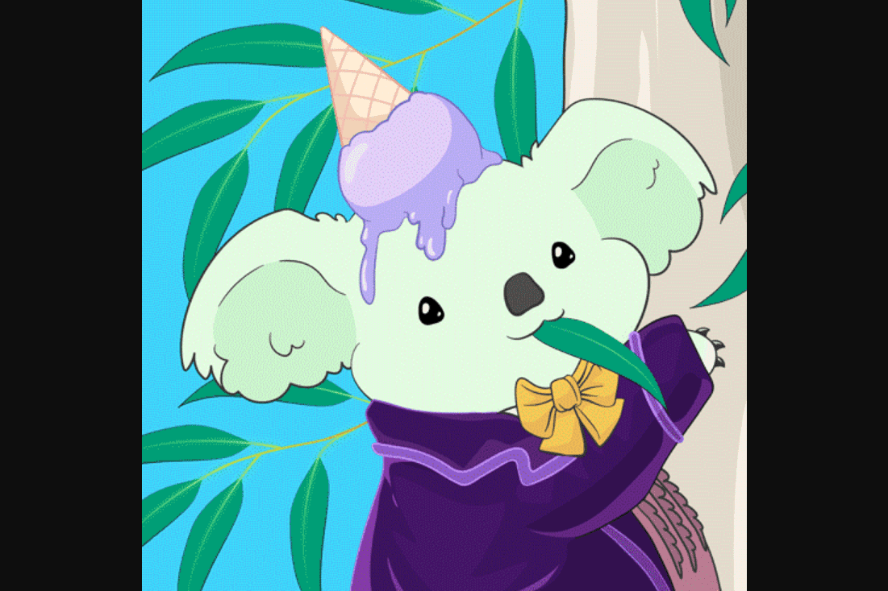

# KuddlyKoalas

Kuddly Koalas 是一个包含 8,888 个 NFT 的可爱集合！
每个铸币厂将把收入的 20% 捐赠给支持考拉栖息地的慈善机构。 Kuddly Koalas 收集的所有版税的 50% 也将捐赠给慈善机构。
公开发布后 48 小时延迟披露。
我们的主要捐赠接受者是澳大利亚世界自然基金会。他们已经启动了 20 亿棵树计划，到 2030 年拯救和种植超过 20 亿棵树。我们还将向考拉医院、WIRES 和斯蒂芬斯港考拉医院捐款。
*我们与上述组织没有正式联系。

