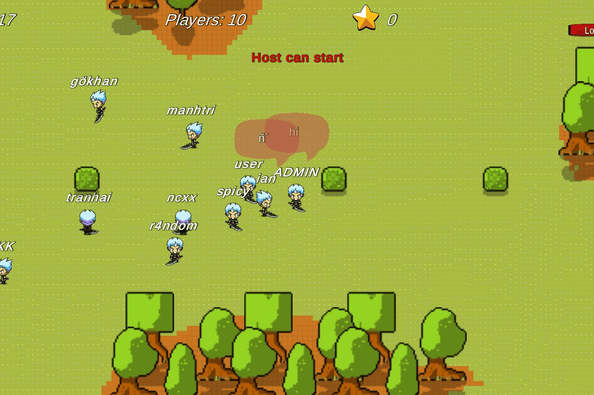

# Kurai Metaverse

连接任何智能合约和 NFT 在在线游戏中与您最喜欢的 DAPP 和 NFT 交互 使用您的 NFT 无论您在 ETH、BSC、POLYGON 上是否有 NFT ......从 Pancake Bunnies 到 Crypto Punks 等等...... .P2E LEADER BOARD上线Polygon链在在线游戏中与您最喜欢的 DAPP 和 NFT 互动利用你的 NFT
1.与志同道合的人聊天并融合💬2.自定义你的角色🎨3.炫耀你的 NFT 🖼️4.玩网络游戏🎮5.赚取奖励💰6.良田农场Kurai MetaVerse 是领先的社交多链 2D MetaVerse，使用户能够与 NFT 和智能合约进行交互。

想象一下这就像一个 Facebook，但你的 NFT 作为你的角色。该项目集成了 ETH、Polygon 和 BSC 网络。因此，如果您有 NFT，例如加密朋克等，您可以在游戏中将它们用作角色。

Kurai MetaVerse 可以连接任何 EVM 链。这意味着它与任何智能合约和 NFT 连接。

借助这项技术，MetaVerse 拥有无限的可能性，包括您最喜欢的单产农场可以集成到 KURAI 中，并在游戏中与它互动，同时与朋友一起玩乐。

  
