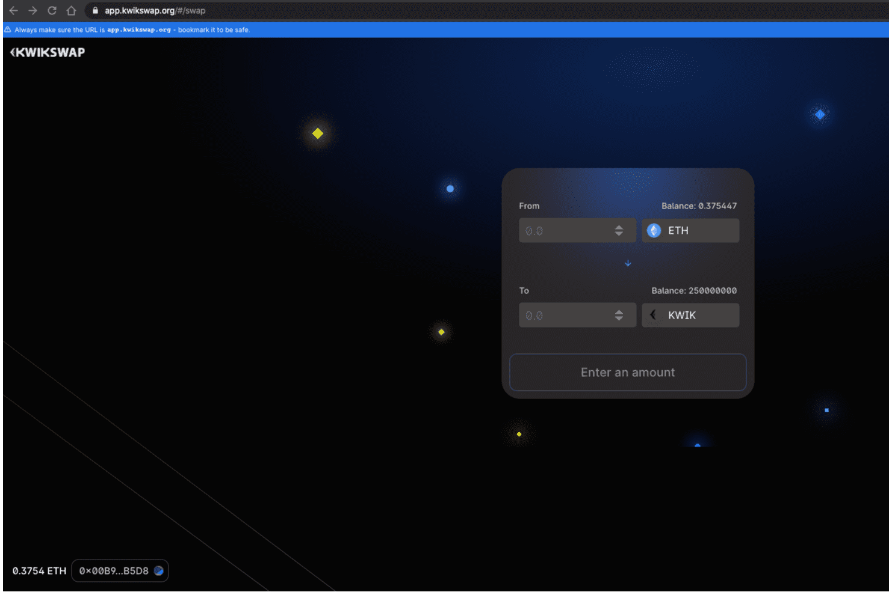

# KwikSwap Protocol

KwikSwap 是具有第 2 层扩展的革命性交换协议，由 Ethereum、Polkadot 和 Plasma 提供支持。交换，增加流动性，创造市场和股权！

KwikSwap 是一种革命性的交换协议，具有由 Ethereum、Polkadot 和 Plasma / OVM 提供支持的第 2 层扩展。该协议目前在以太坊主网上为 V1，在 Polkadot / Plasma 上的 V2 将于 2021 年 1 月下旬推出。用户可以交换、创建市场、增加流动性和质押。 V3 将具有迄今为止去中心化空间中最令人兴奋的功能。用户可以几乎不收取任何费用并以闪电般的速度进行交易！

