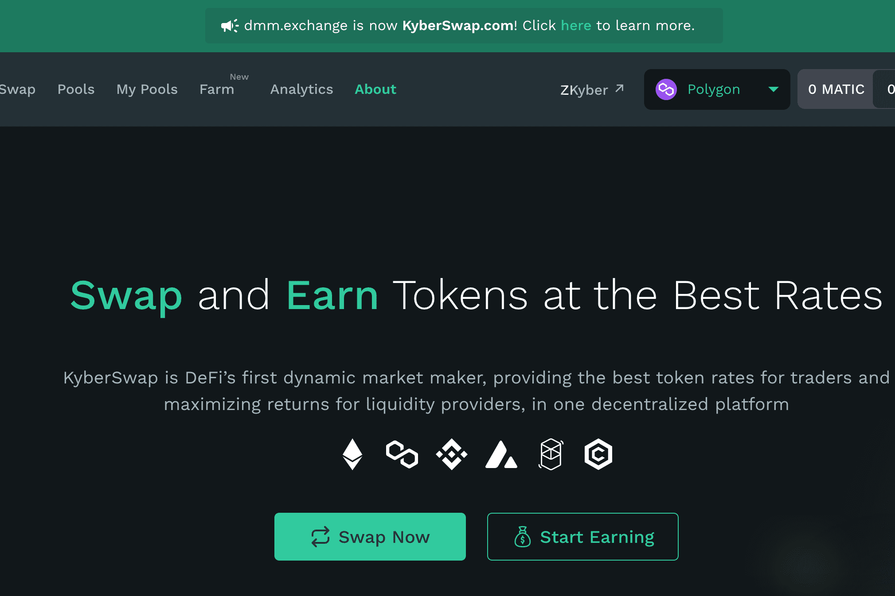

# KyberSwap

KyberSwap 是在 Ethereum、Polygon、Binance Smart Chain (BSC)、Avalanche 和 Fantom 等网络上进行交易和赚钱的最佳场所；您可以获得最优惠的代币兑换率，并通过您的代币资产赚取更多收益。

什么是区块链技术？是一种高级数据库机制，允许在企业网络中透明地共享信息。 区块链数据库将数据存储在区块中，而数据库则一起链接到一个链条中。 数据在时间上是一致的，因为在没有网络共识的情况下，您不能删除或修改链条。 因此，您可以使用区块链技术创建不可改变的分类账，以便跟踪订单、付款、账户和其他交易。作为 DeFi 的第一个多链动态做市商和 Kyber 流动性中心的主要协议，KyberSwap 既是去中心化交易所（DEX）聚合器，又是具有资本效率的流动性池的流动性来源，可为流动性提供者赚取费用。 KyberSwap 允许任何人以即时、方便和安全的方式直接从他们的钱包中转换代币。我们致力于提供：

1. 交易者最优惠的价格

2. 流动性提供者 (LP) 的最佳回报/收益率

3. 更好的可靠性和安全性

4. 完全无需许可

   
