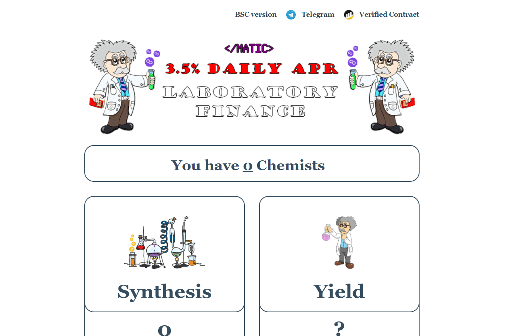

# Laboratory Finance

Laboratory Finance 采用 MATIC 收益优化器，通过多种策略每天奖励 3.5%。
随着玩家在我们的 dApp 中雇佣化学家或收获他们的 MATIC，采矿效率可能会有所不同。
您雇用的化学家越多，您的 MATIC 生产率就越高。
实验室合同是公开的、经过验证的，可以在 Polygonscan 上查看。每个人都可以随时自由撤回投资。
合约是不可变的，并且 100% 没有地毯（开发人员无法使用任何函数来消耗或更改合约操作）

