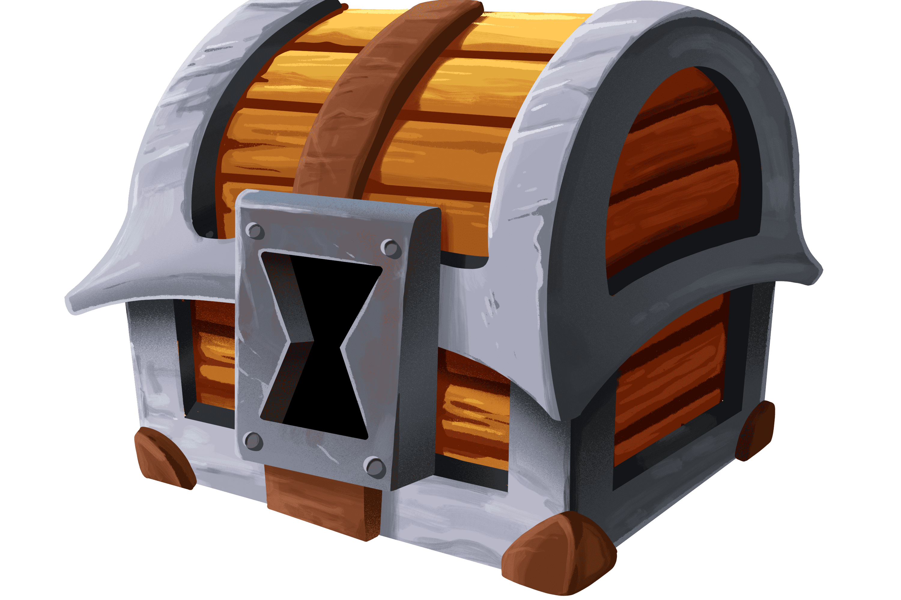

# LadderCaster

LadderCaster 旨在利用多种新兴技术来提供独特的玩家和社区体验，这与业内其他任何东西都不同。用户不仅会被激励在游戏中执行动作，而且会成为社区的积极参与者；最终目标是整个生态系统最终将由去中心化自治组织（DAO）通过多变量代表治理系统进行治理。规则将由组织成员根据多种因素确定，例如 LADA 所有权以及他们在游戏和社区中的活动。这将最终形成一个真正的自上而下、玩家拥有的生态系统，在这个生态系统中，利益相关者不仅可以完全控制他们的资产，而且在提议游戏方向的未来发展和进展方面也有发言权。

