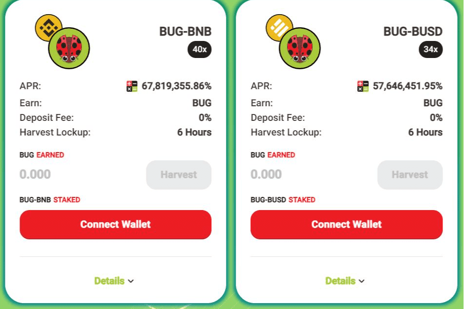

# LadyBeetleSwap

LadyBeetleSwap介绍
LadyBeetleSwap 是专门在币安智能链（BSC）上运行的高频收益农业优化器。
它会自动将用户存入的资产放入利润最高的矿池中。 LadyBeetleSwap 将每分钟都在努力工作，让农民享受多汁的复合效果。
BUG 代币是用于 LadybeetleSwap 项目的州长和激励代币。它作为奖励发行给我们的挖矿用户。

LadyBeetleSwap 是一个 DeFi 项目。这是一个单产农业优化平台。它基于币安智能链。 BUG 是项目的原生治理代币。作为参与者，您可以获得被动收入。
LadyBeetleSwap 社交资料：

LadyBeetleSwap dApp 分析
触手可及的获取最重要的 LadyBeetleSwap dApp 指标 - 分析下面的深度图表，评估 dApp 在不同时间段的活动并做出快速、准确的决策！

