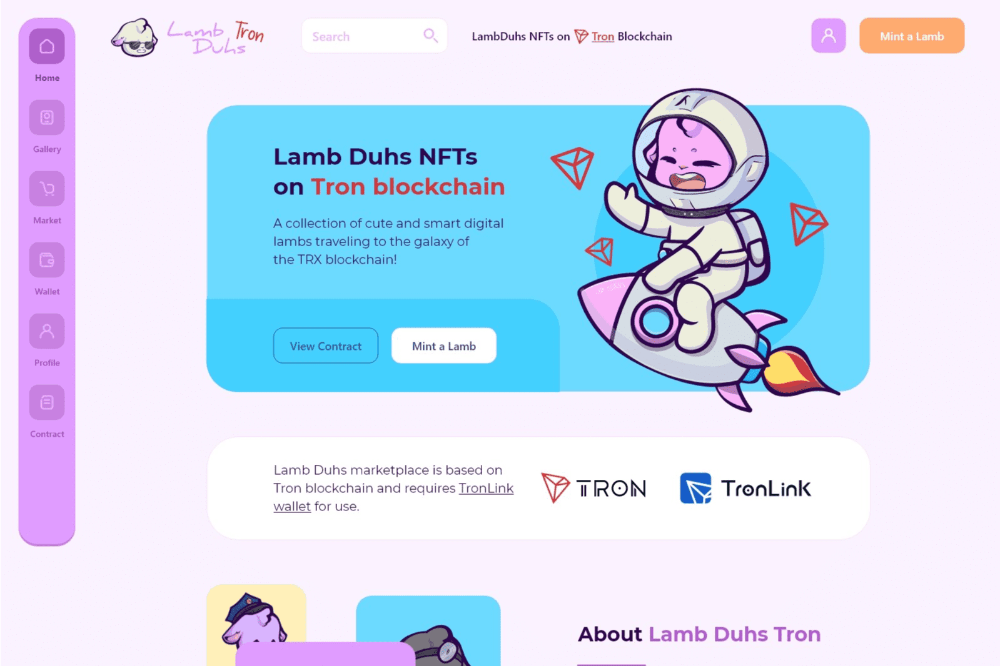

# Lamb Duhs

Lamb Duhs Tron 是一个 NFT 集合，包含可爱而聪明的数字插图小羊头像，由 350K+ 可能的特征组合生成，具有丰富多样的面孔、服装和颜色。
Lamb Duhs Tron 托管在 Tron 区块链上。 Lamb Duhs Tron 是首批使用 Tron 的 TRC-721 标准的高质量 NFT 集合之一。 Lamb Duhs Tron 市场也在 Tron 区块链上，需要 TronLink 钱包来铸造、购买或出售 NFT。
Lamb Duhs 是 Duhverse 的原始集合，8500 只数字小羊在以太坊区块链的草原上游荡！但现在这些小羊们正在前往波场区块链的银河系中，在这个新世界中寻找新的美妙可能性！
Lamb Duhs Tron 是 Tron 仍处于新生 NFT 领域的首批高质量艺术项目之一。他们的以太坊同行已经在二级市场上交易了超过 532 ETH 的交易量。
根据它们的独特性，每个头部和身体配件价值 1-4 分。例如，普通衬衫或棒球帽等更常见的物品比礼帽或宇航员套装等更时尚的物品价值更低。
然后将这些附属点相加，得到 2-8 点之间的总值。该值决定了羔羊的稀有等级，每个等级都与自己的颜色相关联。结果，通过查看背景颜色可以轻松识别羔羊稀有度和附件点！
您可以在 Tron 区块链网络上从 Lamb Duhs NFT 收藏中铸造一只独特的羔羊。 Tron 区块链上的 Mint Lamb Duhs NFT 并成为独特 Lamb NFT 的所有者。
遵循 NFT 领域的最佳实践，我们坚持透明、固定的铸币成本模型。每只羔羊的价格为 1500 TRX，您可以随心所欲地获得！您可以使用任何网络浏览器或移动设备铸造它们。您只需要一个 TronLink 或 Klever 钱包即可开始使用。

