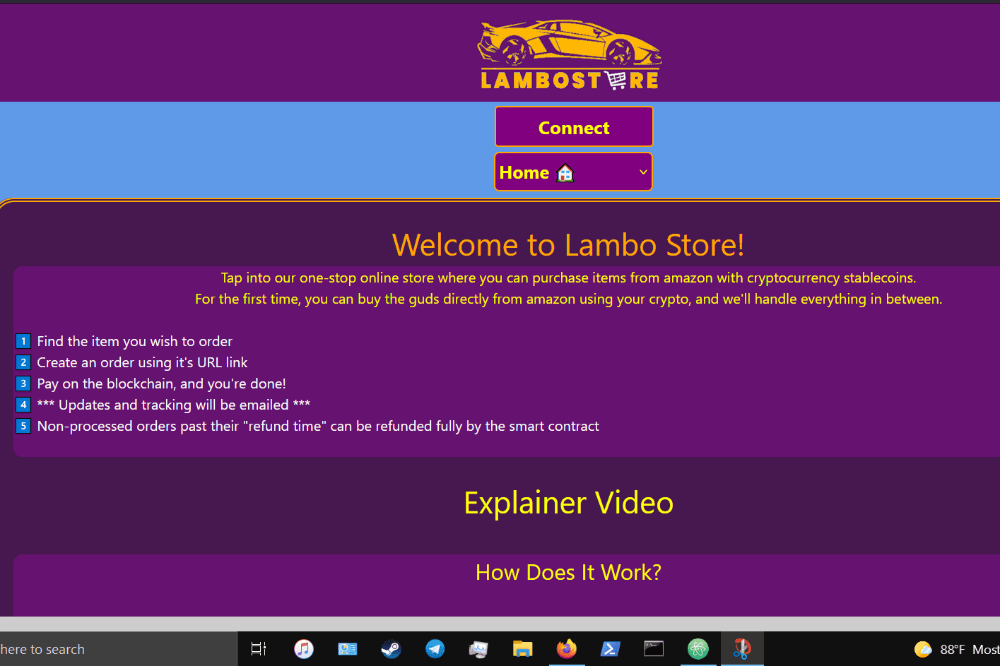

# Lambo Store

lambostore.org 是一种加密支付选项，可以使用币安智能链上的稳定币购买亚马逊商品。用户可以将该应用程序与任何浏览器钱包一起使用，包括 Trust Wallet DApp Browser 和 Metamask。用户可以在手机上通过区块链订购亚马逊！我们的目标是让加密货币在世界各地的日常生活中更加融合
订单信息使用 AES256 位对称加密进行加密。 AES 密钥本身使用 PGP 非对称加密进行加密，然后与订单详细信息和付款一起发送到区块链。所以，订单信息只能由平台可靠解密，只有订单支付稳定币转账才会在区块链上公示。如果订单在其“结束时间”（默认为 3 天）之前未被平台管理员确认或“拒绝”，用户可以自行退款 100%。资金保存在智能合约中，直到订单以某种方式更新或退还给客户。
该平台还有一个分散的会员推荐计划，允许用户每确认订单赚取 1 美元。平台管理员在区块链上确认订单后，立即向关联公司付款。还有一个“附属机构”页面，允许附属机构生成指向自动填充项目、附属钱包地址、成本和数量的网站的链接。此外，该平台在“精选”页面底部出售去中心化广告空间，允许使用原生区块链硬币购买该页面上的广告空间。

