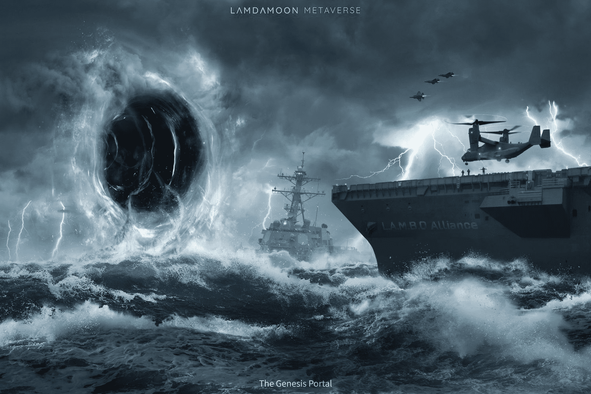

# LAMDAMOON METAVERSE

Lamdamoon Metaverse 是一款基于 Moonbeam/Polkadot 和 Unreal Engine 5 构建的实验性高端 3D NFT 游戏。
Lamdamoon是L.A.M.D.A太阳系的第三颗行星Lamda的卫星。 Lamda 这个名字来自 Lonely Asteroid May Discover Anecdotes (L.A.M.D.A)，您可以在故事部分找到更多信息。
你可以在这里建造月球基地、宇宙飞船、军队，甚至是暗物质驱动的传送门。所有这些都是你探索、保护土地、开采资源、发现古老外星技术蓝图并与怪物战斗以在远离地球的遥远星系中的奇异行星上获得 Lamdanium 奖励的垫脚石。
无聊的时候，你可以随时与其他玩家进行陆战，甚至可以在拉姆达的天空中驾驶宇宙飞船互相射击。如果胜利，您将接管他们的资产，如果失败，您将失去您的资产。因此，在进行战斗之前要小心。
此类活动将以身临其境的逼真 3D 体验进行，由世界上最先进的游戏引擎提供支持。
最棒的是，你拥有你努力实现的一切。它永久存储在区块链上，没有人能够从你那里拿走它。
你已经被炒作了吗？太好了，现在让我们为你的宇宙飞船加油并飞往月球。

