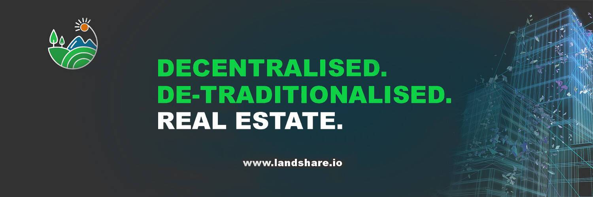

# Landshare

Landshare为大众带来了房地产投资的梦想。 Landshare 拥有基于资产的稳定币保险库、实用代币、房屋翻转池和治理协议，提供基于美国房地产资产的成熟 DeFi 平台。只需将您的稳定币存入我们的 Property Vault，即可根据资产的租赁价值和升值赚取收益，或投资于我们的房屋翻转池以获得一次性支付。

土地价格实时数据
今天的 Landshare 实时价格为 0.730810 美元，24 小时交易量为 50,569.88 美元。我们将土地实时更新为美元价格。土地份额在过去 24 小时内下降了 8.91%。当前的 CoinMarketCap 排名为 #1211，实时市值为 2,031,730 美元。它有 2,780,107 枚 LAND 币的流通供应量，最高可达 2,780,107 枚 LAND 币。供应 10,000,000 LAND 币。

如果您想知道以当前价格在哪里购买 Landshare，目前用于交易 Landshare 股票的顶级加密货币交易所是 Gate.io、PancakeSwap (V2) 和 ApeSwap (BSC)。您可以在我们的加密交换页面上找到其他列表。

