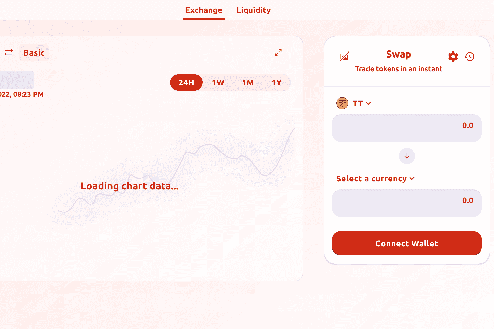

# LaserSwap

LaserSwap，ThunderCore (TT) 上的第一个 DEX V2，提供出色的交易体验和赚钱机会。我们的服务包括 AMM 交易所、收益农业以及即将推出的启动板和 DeFi 功能。

在 2 月底之前，任何使用#LaserSwap 交易超过 10 美元的人都将收到 #LASER 代币。 #airdrop 总金额将为 1 周的lasersPerBlocks。

LaserSwap 是 ThunderCore 上的一种去中心化交易所 (DEX)，它使用自动做市商 (AMM) 来交易数字资产。用户可以兑换代币...

