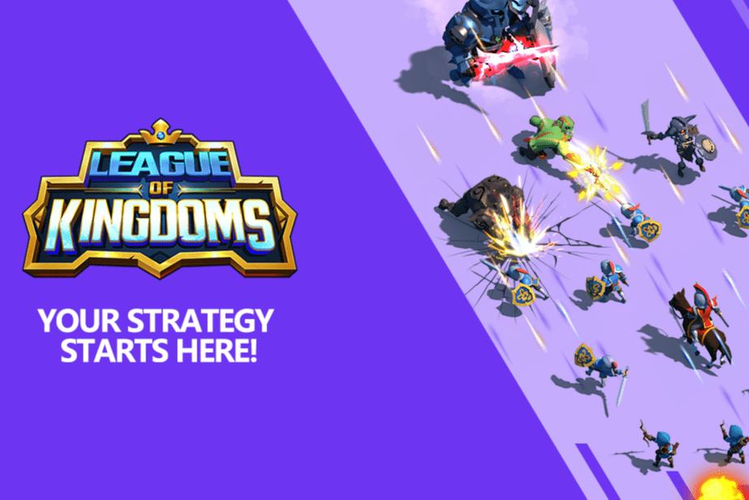

# League of Kingdoms

王国联盟是一款基于区块链的免费 MMO 战争策略游戏。王国联盟的主要游戏玩法类似于传统的 RTS（实时策略），但它由区块链技术提供支持，所有权是游戏核心概念的核心。作为一款基于联盟的战术策略游戏，玩家可以建立王国，组建军队，组建联盟，在战场上竞争。游戏中的所有土地都是不可替代的代币，可以归用户所有。
玩家不需要任何有关加密货币的经验或知识来玩游戏，也不需要拥有 Land NFT 来种植可以被标记为 NFT 的资源。随着 LOKA 代币的采用，《王国联盟》正在享受更多的玩家采用、包容和激活，因为玩家可以在游戏平台上有效地拥有、提议、投票和赚钱。
LOKA 是《王国联盟》的本地治理代币，将用作《王国联盟》游戏特许经营权中的货币，并将用于所有游戏内商店购买，例如购买包、皮肤、商品。 $LOKA 代币将用作 NFT 助推器，以创建、升级和获取特殊的 NFT 资产，包括但不限于即将推出的 Drago 和 Skin NFT。 LOKA 代币还将用于提议和投票链上治理提案，以确定游戏的未来功能、政策、内容和/或参数。最后但并非最不重要的一点是，还可以通过参加游戏内竞赛和/或完成特殊任务来获得 LOKA 代币——例如，在每次 Continent vs. Continent (CvC) 战斗之后，获胜者将获得 LOKA 代币（以及可能更稀有的 NFT 项目）奖励！）取决于战斗中的表现。

