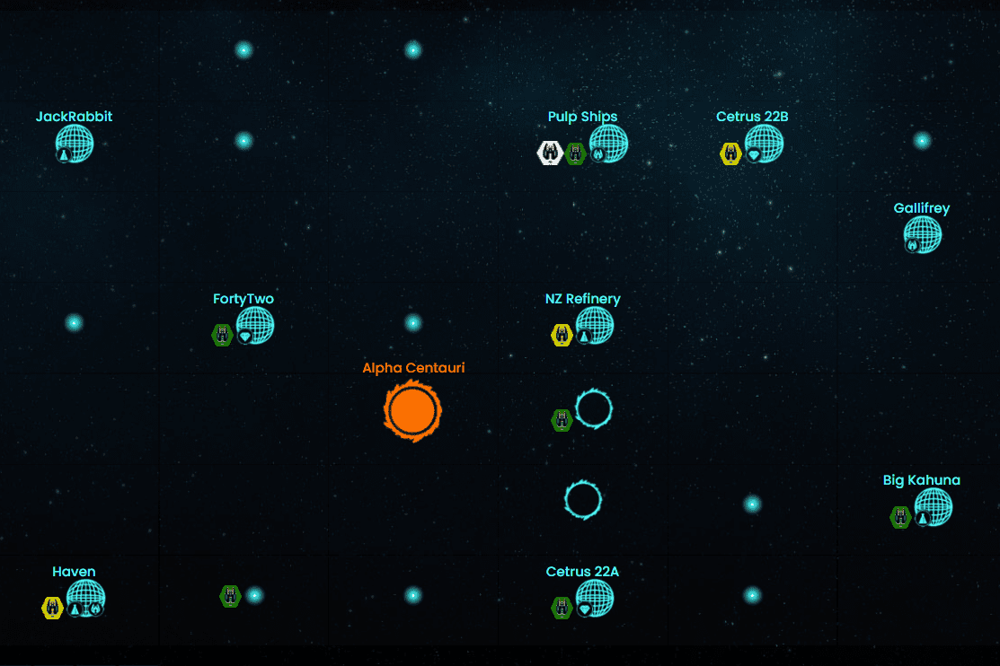

# Legend of Novaria

诺瓦利亚传奇 (LoN) 是一款完全在 BSC 上推出的 4x P2E MMO 太空主题策略游戏。 4x 策略意味着 1) 构建、2) 探索、3) 防御和 4) 攻击。
LoN 是一款真正的“大型多人在线游戏”(MMO)，它需要高度复杂和细致入微的策略，就像一场激烈的国际象棋或扑克游戏。
想象一下饥饿游戏、权力的游戏和大清洗合二为一——那就是《诺瓦利亚传奇》。
游戏玩法：
游戏的目标是建立您的舰队，穿越 Novaria 地图，探索和发现行星和小行星，以便在 Novaverse 中开采珍贵的矿物。然后将这些矿物质提炼并转化为 $NOVA！
但一切并不像看起来那么简单。
在此过程中，其他舰队可以攻击并占领您的矿产和其他资源。你会捍卫自己的地盘还是站在一旁？你会报复吗？有许多策略需要考虑——每个策略都有自己的多米诺骨牌世界。
诺瓦利亚的世界是一个不断扩展、不断挑战的世界——现在去选择你自己的冒险吧！!

