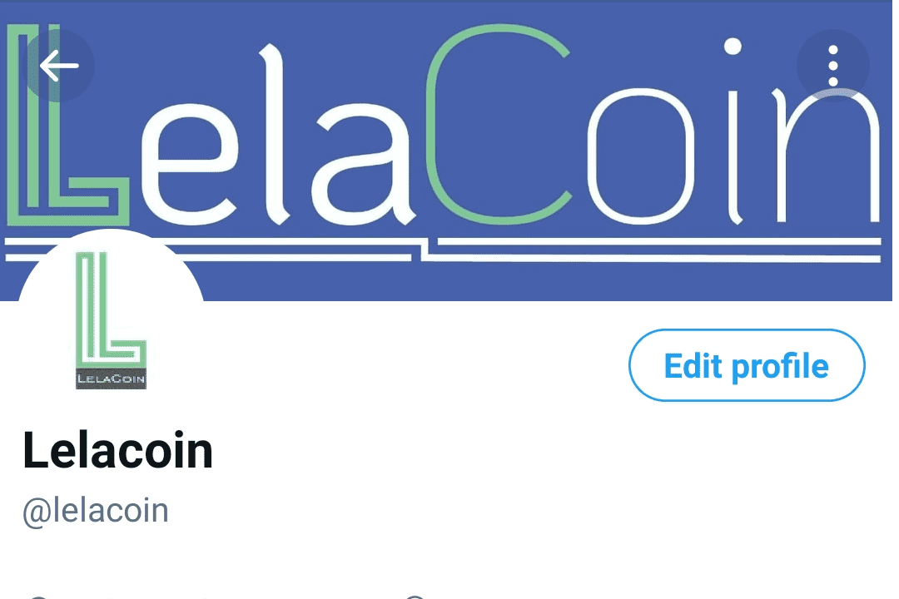

# Lelacoin

LelaCoin 代币是在 Binance 和 Tron 区块链上创建的加密货币。 LelaCoin 旨在增加不同生活活动领域的价值。当前的金融转型为稳定金融界的活动提供了很多帮助。世界各地的许多社区，尤其是年轻人社区已经接受了金融革命，并投资了具有高价值回报的加密货币。
LelaCoin 项目还概述了使用加密货币和其他法定货币带来投资机会，这将通过减轻贫困和为财务自由铺平道路，在减轻个人负担方面提供机会并发挥巨大作用。
智能且安全。

