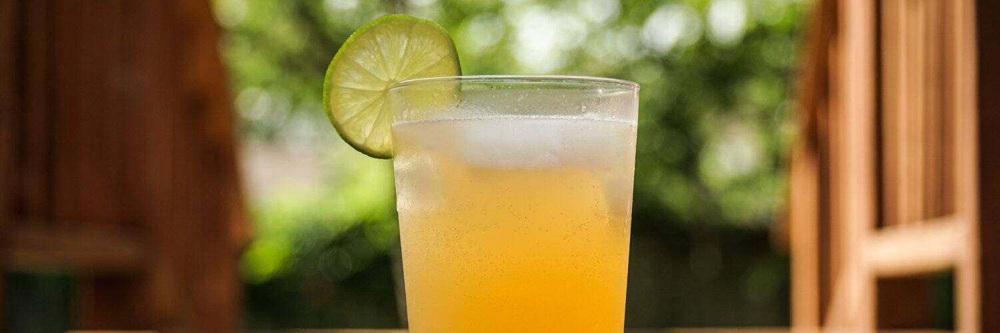

# Lemonade Farm BUSD Miner

首屈一指的可持续发展驱动项目，在 BUSD 上提供高达 8% 的每日投资回报率。
特点包括：
大奖彩票
6% 推荐奖金
5% 每日建造奖励
12 小时复合计时器
防地毯合同
可持续性措施包括：
48 小时无人认领的柠檬水截止
5次强制复合特征
80% 提前提款税
基于合同健康的 APR（投资回报率从 3.3%~8%）
每日提款窗口（每日限额基于合约健康状况）
1K Max 每日提款限额

