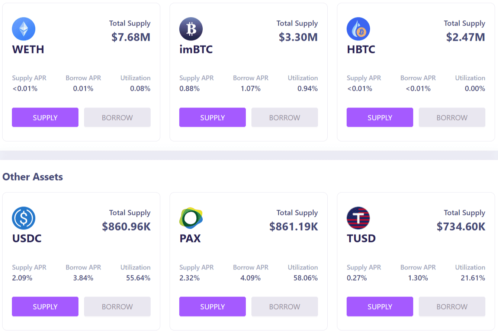

# LendfMe

Lendf.Me 是一个 dForce 生态系统项目和货币市场协议，通过匹配任何 ERC20 兼容资产的供应和借贷来实现即时可访问性和流动性。您可以存入稳定币以赚取收益或通过加密抵押品借入受支持的资产。所有加密贷款都将通过自动执行的智能合约运行，无需中间人和相关成本。

在以太坊区块链上运行的去中心化交易所（DEX）存在安全问题。 MakerDAO 的 Compound 是一个去中心化金融 (DeFi) 借贷平台，几周前遭到黑客攻击，随后 Uniswap DEX 遭到攻击。在最近一次攻击之后，dForce 提供的 DeFi 借贷平台 Lendf.me 几乎立即遭到黑客攻击，导致用户资金损失 2500 万美元。对于这些人来说幸运的是，迅速的反应帮助收回了大部分资金，这些资金现在将退还给用户。

Lendf.me 在几天前对持续崩溃的更新中解释说，收回的资金已转移到一个单独的恢复账户，并一直在努力完成审计和报销策略，以平息用户的愤怒。

