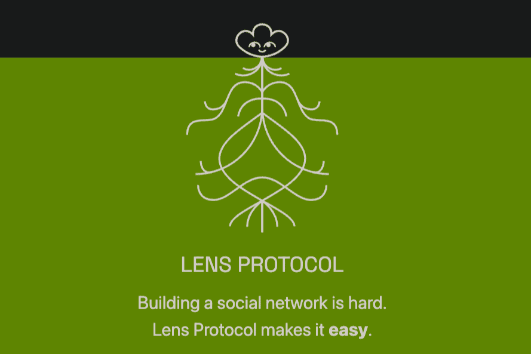

# Lens Protocol

Lens 协议的目的是让创作者拥有自己与社区之间的联系，形成一个完全可组合的、去中心化的社交图谱。这是通过允许用户创建配置文件并通过这些配置文件相互交互来实现的。 “配置文件”（如此处使用的）特指镜头配置文件； “用户”是指标准的加密钱包。
该协议是从头开始构建的，并考虑到了模块化。 Lens 协议目前由 multisig 监督，它将扩展到更广泛的 DAO，可以开发和投票新模块和扩展功能。

