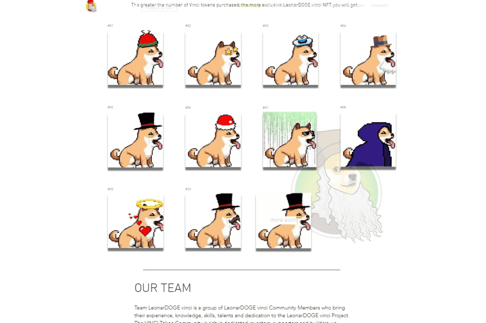

# LeonarDOGE vinci

LeonarDOGE Vinci - 很快它将成为一个为著名艺术家设计的新的集成 NFT 平台和市场。他的愿景是基于 BSC 区块链，开启下一次“创意复兴”。该项目旨在实施一种独特的商业模式，让艺术家和创作者可以自信地将他们的 NFT 作品直接提供给他们的观众，消除中介，让他们在自己的业务中茁壮成长。 LeonarDOGE Vinci 从一开始就努力兑现 NFT 的承诺——建立一个真正为创作者及其粉丝服务的经济体。
VINCI 代币现在正在预售中。 VINCI 代币将由 LeonarDOGE vinci 市场平台发行，并将用于运营及其产品，特别是购买或出售 NFT 时的货币。
VINCI 代币将由 LeonarDOGE vinci 市场平台发行，并将用于运营及其产品，特别是购买或出售 NFT 时的货币。
VINCI 与平台本身一样，在 BEP-20 标准的平衡智能链 (BSC) 网络中工作（SOLANA (SOL) 网络即将推出）。

