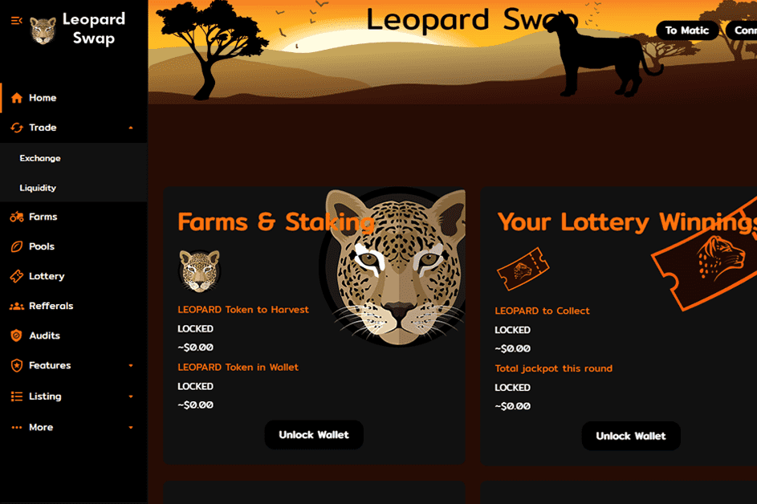

# LeopardSwap (BSC)

概述：
农场即将推出！！！
Polygon 和 BSC 网络上的 Panther Clone
多链 AMM 和 Yield Farm
高 APY 游泳池和农场
彩票系统
老虎机投注游戏
濒危动物 NFT
什么是豹交换？
LeopardSwap 首先是一个去中心化的社会企业。我们正在使用收益农场来支持项目的流动性和产品的推出。我们的目标是让这个生态系统既为我们的投资者提供回报，又成为拯救濒危动物的持续收入来源！
LeopardSwap 也是一个以影响为导向的革命性农业生态系统，包含 AMM、自动流动性、彩票、老虎机等，Leopard Swap 旨在让持有者在波动期间获利并帮助拯救濒临灭绝的动物！
代币经济学：
代币信息：
代码： 豹
初始供应：1,000,000
最大买/卖：5000
滑点：5%+
Polygon 代币发布：UTC 时间 7 月 23 日晚上 8 点
BSC 代币发布：UTC 时间 7 月 23 日晚上 10 点
转让税：
⁃ 每笔 $LEOPARD 转账的 2% 将被立即销毁
⁃ 2% 的转让税将添加到 LP 池并锁定
⁃ 0.5 %

