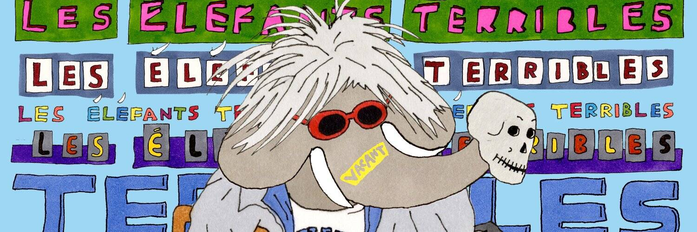

# Les Elefants Terribles

Les Éléfants Terribles 是一个包含 5,313 位随机生成的创意幻想家的高概念合集，所有这些都是从 373 幅来自邪恶古怪的艺术、喜剧、时尚、电影、文学和音乐世界的“可怕的孩子”的手绘文化参考资料中可爱而痴迷地实现的。这是一个经过精心研究的艺术项目，源于对历史上无政府主义艺术家及其标志性作品的深入研究，所有作品均由纪尧姆·科内特（Guillaume Cornet）用旋转笔和记号笔在纸上手工绘制。从艺术/喜剧/时尚/电影/文学/音乐中的标志性可怕儿童的手绘文化参考中随机生成 5,313 只大象。

