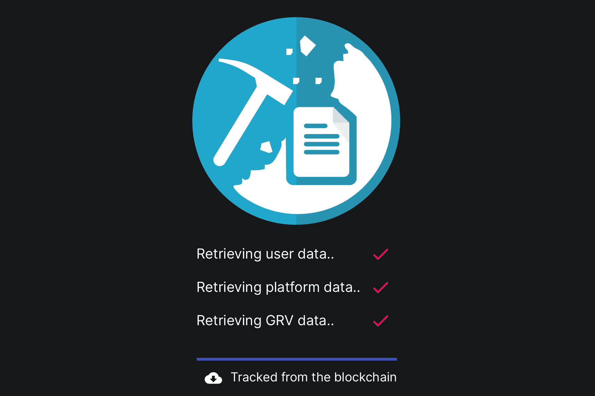

# LetsMineSome

感谢我们的矿池合约，挖矿 GRV 从未如此简单！我们的合约是通过不断向 gravyhftdefi 合约发送 TX 来挖掘 GRV，TX 的频率基于矿池 CPU 容量。两台服务器在后端并行运行，以保证此服务的最大可靠性。

LetsMineSome。加入我们的链上矿池，无需运行任何后端即可轻松开始挖掘 GRV 代币！ #7155一般来说。 #1738.在 DeFi 中。 ＃400。在 EOS。加入我们的链上矿池，无需运行任何后端即可轻松开始挖掘 GRV 代币！

