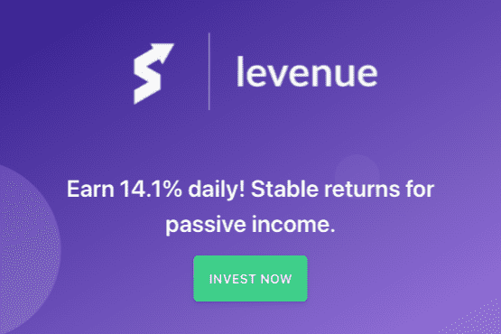

# Levenue

什么是乐天？
Levenue 模仿了 SSI（从你的每一笔薪水中扣除的税）的想法，但对其进行了改进，以创造短期的高利息利润。投资者将资金集中在一起，并根据其投资的锁定期获得回报。智能合约依赖于持续的投资者和投资者的稳定增长，造成其流动性的周期性波动。
Levenue 将您的 BUSD 锁定 10、20 或 30 天，并允许您提取一定比例的利息。三个锁定期的不同之处在于随着时间的推移您将获得多少利息。智能合约内容如下：
10 天 = 您投资的 141%
20 天 = 191% 的投资
30 天 = 您投资的 241%
什么时候是投资Levenue的最佳时机？
随着时间的推移，投资继续增长！我们有一个创新的半提取功能，让您可以在复利的同时获利！
什么是投资回报合同？
ROI 合约是加密社区汇集其代币以获得短期利润的一种新方法，这只需要几天时间！

